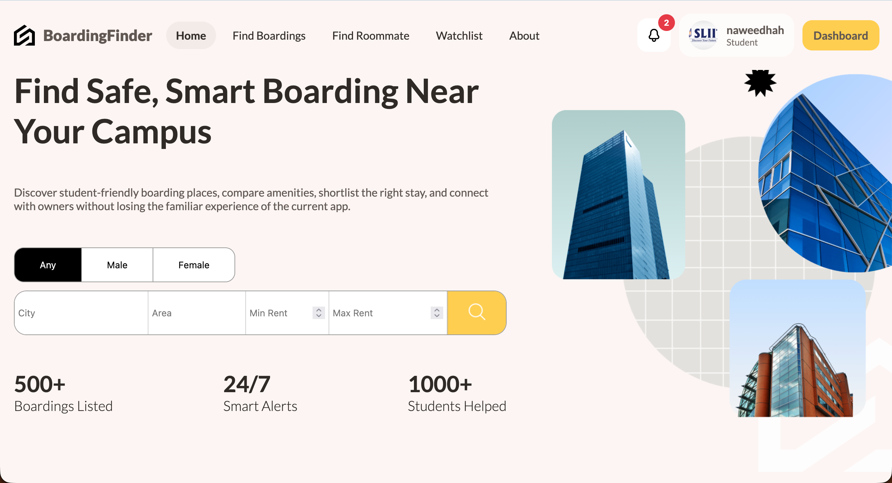
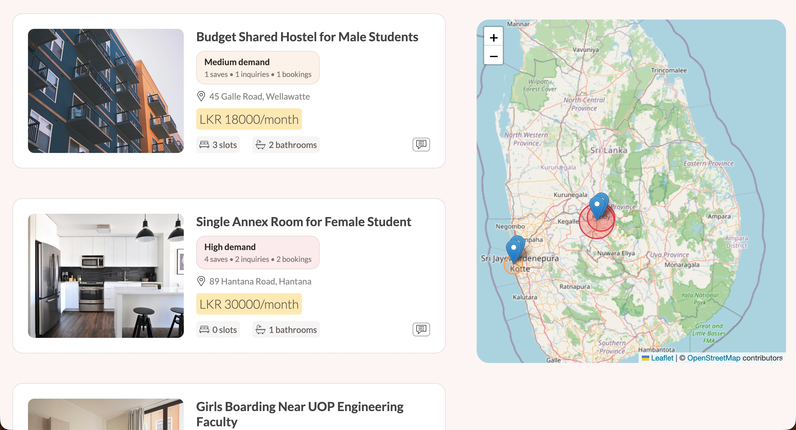
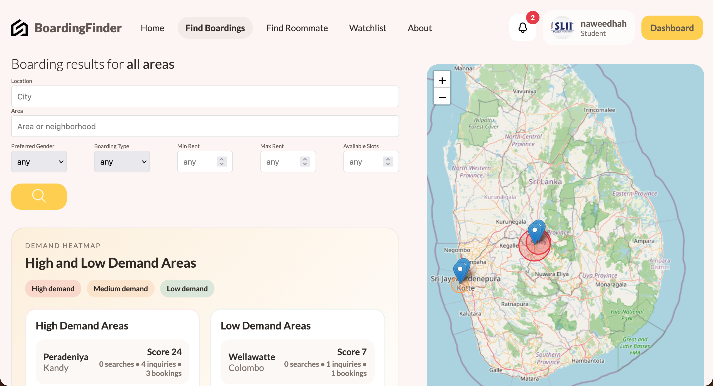
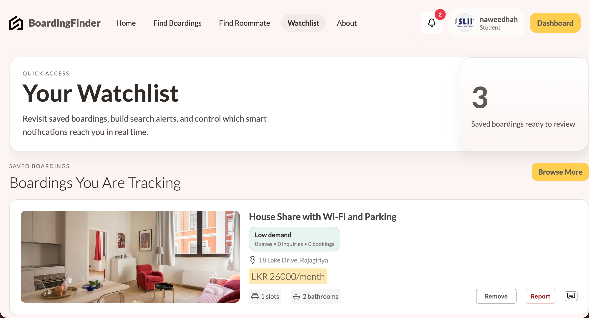
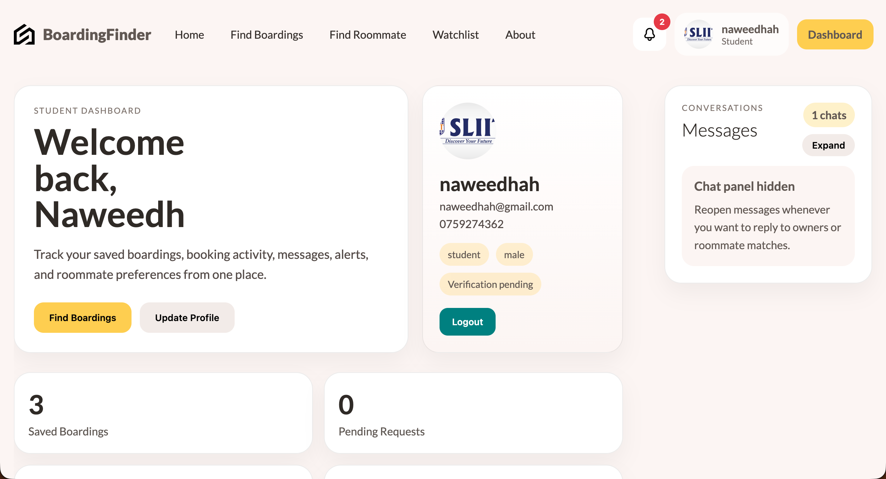
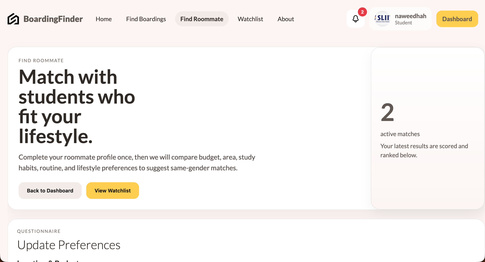
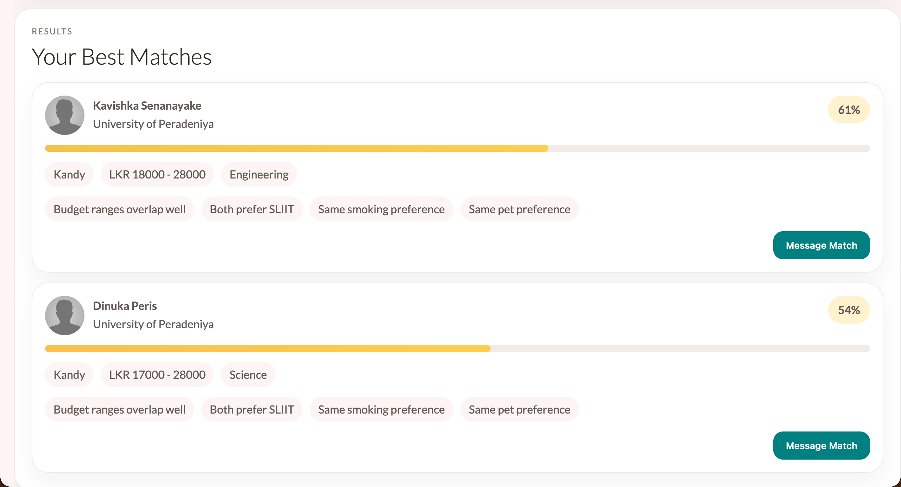

# BoardingFinder

BoardingFinder is a full-stack student boarding platform for discovering listings, viewing locations on a map, saving favorites, sending inquiries, chatting in real time, and managing bookings.

## Features

- Student boarding search with filters for city, area, price, gender, type, and available slots
- Interactive Sri Lanka map view for listings and demand areas
- Listing details with amenities, nearby places, demand insights, and booking flow
- User authentication and protected dashboards
- Saved listings and watchlist-based search tracking
- Real-time chat and inquiry messaging
- Booking request and payment workflow
- Roommate matching
- Notifications and smart alerts
- Reporting and safety moderation tools
- Admin dashboard for platform oversight

## Project Structure

- `client` - React + Vite frontend
- `api` - Express + Prisma + MongoDB backend
- `socket` - Socket.IO realtime service

## Requirements

- Node.js
- npm
- MongoDB database

## Environment Variables

Create an `.env` file in `api/` with at least:

```env
DATABASE_URL=your_mongodb_connection_string
JWT_SECRET_KEY=your_jwt_secret
CLIENT_URL=http://localhost:5173
PORT=8800
```

## How To Run

1. Install dependencies:

```bash
cd client && npm install
cd ../api && npm install
cd ../socket && npm install
```

2. Seed the database if needed:

```bash
cd api
npm run seed
```

3. Start the backend:

```bash
cd api
npm run dev
```

4. Start the frontend:

```bash
cd client
npm run dev
```

5. Start the realtime socket server:

```bash
cd socket
node app.js
```

Frontend: `http://localhost:5173`  
API: `http://localhost:8800`  
Socket server: `http://localhost:4000`

## Screenshots

### Home / Landing



### Listings And Map



### Demand Insights



### Watchlist



### User Dashboard



### Roommate Finder



### Roommate Matches


